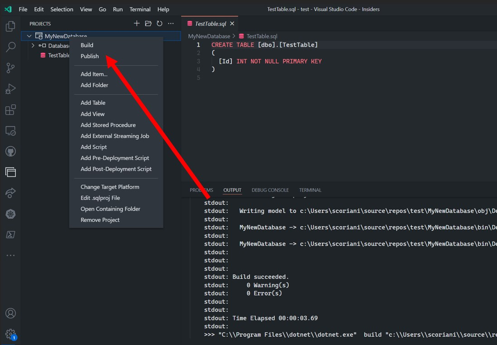

# Welcome to Azure SQL Database Local Development experience!

## Overview
Microsoft Azure SQL Database Local Development experience for Azure Data Studio and VS Code provides a way to design, edit, build/validate, publish and run schemas for Azure SQL databases from a source-controlled project to one or more offline database instances, running in a containerized environment that offers closest fidelity with what Azure SQL Database public service. Once development gets to a more mature stage, developers can easily publish the same project to public service from the same environment, and manage the entire lifecycle of their databases (e.g. manage schema drifts and such).

## VS Code
Microsoft SQL Server Database Projects for Azure Data Studio and VS Code provides a way to design, edit, and publish and runvi schemas for Azure SQL databases from a source-controlled project.

## Getting Started with Database Projects
•	Create a new database project by going to the Projects viewlet or by searching Projects: New in the command palette.
•	Existing database projects can be opened by going to the Projects viewlet or by searching Projects: Open Existing in the command palette.
•	Start from an existing database by using the Create Project from Database from the command palette or database context menu.
•	Start from an OpenAPI/Swagger spec by using the Generate SQL Project from OpenAPI/Swagger spec command.

Provide a name for the new database project:
 

Start working on your project, adding database objects like tables, views, stored procedures and such:
 

 
Database project files can be put under source control together with your application projects:

You can get edit and build time support for your database project objects and scripts by selecting a proper target platform for your project. This will let VS Code to highlight syntax issues or the usage of unsupported features for the selected platform:
 

 
You can build your project and validate that it will work against the selected platform:

Once database project is ready to get tested, you can publish it to a target:

You can select between an existing or a new server:

And you select between Azure SQL Database “lite” and a “full” images. With the former, you will get compatibility with most of Azure SQL DB capabilities and a lightweight image that will take less to download and instantiate. Selecting “full”, you will have access to advanced features like In-memory optimized tables, geo-spatial data types and more, but at the expense of more required resources:

You can create as many local instances as necessary, based on available resources, and manage their lifecycle through VS Code Docker Extension or CLI commands.

 
Once instances of your database projects are running, you can connect from VS Code mssql extension and test your scripts and queries, like any regular Azure SQL Database instance in the cloud:
 

 
For each iteration and modification, SQL project can be rebuilt and deployed to one of the containerized instances running on the local machine, until it’s ready.
 
 

Last step of database project lifecycle can be to publish the finished artifact to a new or existing Azure SQL Database instance in the cloud through the mssql extension:
 
